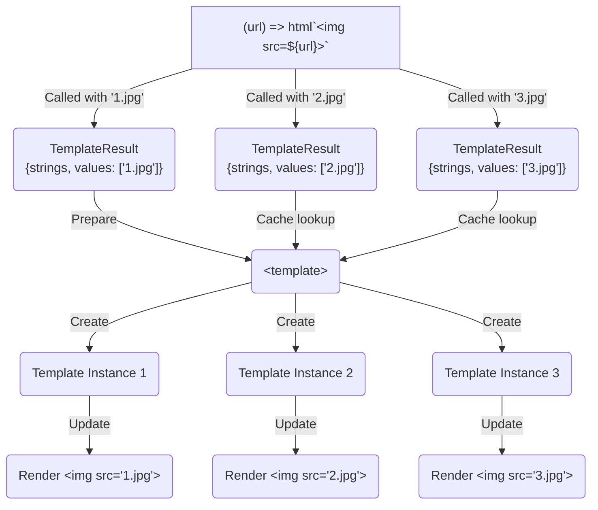
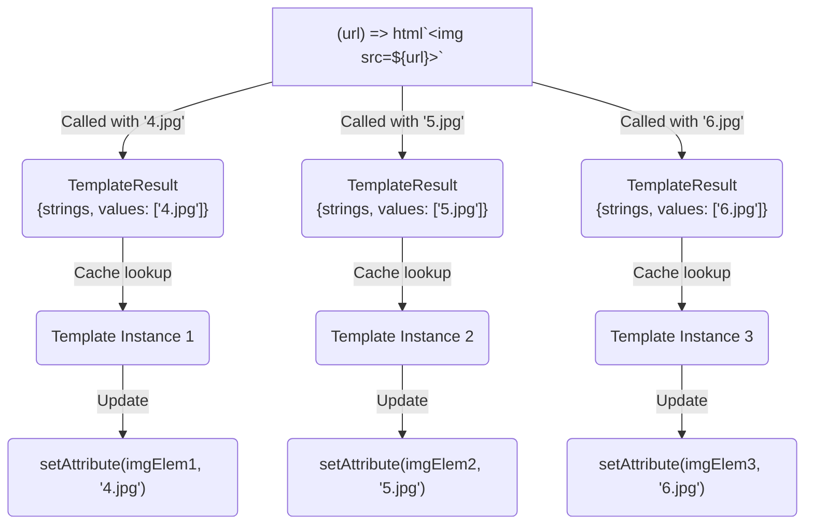

# Life of a lit-html render

## About this Document

This is an overview for how lit-html works, what makes it fast, and how the code is organized. It's intended for contributors, or anyone who is interested in the inner workings of lit-html. It is not a tutorial or introduction for Lit. For introductory material see the [Intro to Lit Tutorial](https://lit.dev/tutorials/intro-to-lit/), or [Using lit-html standalone](https://lit.dev/docs/libraries/standalone-templates/) documentation.

All the source code described by this document can be found in [`lit-html.ts`](https://github.com/lit/lit/blob/main/packages/lit-html/src/lit-html.ts).

If anything is unclear or you have questions, reach out on our [Discord channel](https://discord.com/invite/buildWithLit), or ask a question on [GitHub Discussions](https://github.com/lit/lit/discussions). All our communities can be found on the [Lit Community page](https://lit.dev/docs/resources/community/).

# What is lit-html?

lit-html is an HTML templating library. Templates are written in JavaScript by mixing static HTML strings and dynamic JavaScript values using template literals. lit-html enables writing UI as a function of application state, it has fast initial rendering, and fast updates that minimally update DOM when state changes.

lit-html is very performant as can be seen in the [JS Frameworks Benchmark](https://krausest.github.io/js-framework-benchmark/). A great companion to this document is [Justin Fagnani's lit-html talk](https://youtu.be/Io6JjgckHbg).

# Foundational Pieces

lit-html's design arises naturally out of combining two powerful web primitives: [JavaScript Tagged Template Literals](https://developer.mozilla.org/en-US/docs/Web/JavaScript/Reference/Template_literals#tagged_templates) (TTLs) and the HTML [`<template>`](https://developer.mozilla.org/en-US/docs/Web/HTML/Element/template) element.

TTLs provide an explicit syntax for separating static strings of HTML content and dynamic JavaScript values. The static strings are immutable and preserve identity across multiple evaluations of the tagged literal making them ideal for use as a cache key.

The `<template>` element provides a container for HTML content that can later be cloned into the document. In a template element: scripts don't run, styles don't apply, custom elements don't upgrade, etc. During rendering, a template's content can be cloned or imported into the Document which makes the cloned nodes active.

# Rendering

## Summary of lit-html rendering phases

lit-html templates are only a description of the UI. They must be rendered with `render()` to affect the DOM. The **Define** and **Render** phases are controlled by the user of Lit, while **Prepare**, **Create**, and **Update** are internal phases. Rendering is split into internal phases so we can cache and reuse work done in the Prepare and Create phases.

<ol>
<li>

**Define**: `` const ui = (title) => html`<h1>${title}</h1>` ``

</li>
<li>

**Render**: `render(ui("Example Title"), document.body)`

</li>
<ol type="a">
<li>

**Prepare**: The first time `render()` is called for each unique TTL, create a `<template>` element containing the static HTML and Lit `TemplatePart`s encoding a mapping for each dynamic JavaScript value to its location in the static HTML.

</li>
<li>

**Create**: The first time `render()` is called for a given node and template, clone the `<template>` contents into the DOM and instantiate the Lit `Part`s which manage the dynamic content.

</li>

<li>

**Update**: Iterate over the dynamic JS values and associated Lit `Part` only committing the values that have changed to the DOM. This is the only phase that's called every time a template is rendered.

</li>
</ol>
</ol>

The end result is `<h1>Example Title</h1>` rendered in the `<body>` element. If the user now executes `render(ui("Updated"), document.body)`, only the **Update** phase runs skipping the **Prepare** and **Create** phases.

## Motivating example

This example will be referred to throughout the rest of the document to concretely show what lit-html is doing during each internal rendering phase.

```html
<!-- File: index.html -->
<script type="module" src="./example.js"></script>
<style>
  .odd {
    color: green;
    text-decoration: underline;
  }
</style>

<div id="container"></div>
```

```js
// File: example.js
import {html, render} from 'lit';

const container = document.querySelector('#container');

const counterUi = (count) => html` <span class="${count % 2 == 1 ? 'odd' : ''}">
    ${count}
  </span>
  <button @click=${() => render(counterUi(count + 1), container)}>
    Increment
  </button>`;

render(counterUi(0), container);
```

[Live example in the playground.](https://lit.dev/playground/#gist=a1058bae08d79928fc2fafaf02b04581)

The sample code results in a counter which increments when the "Increment" button is clicked:


## 1. Define

Templates are defined with the `html` tag function. This tag does very little work — it only captures the current values and a reference to the strings object, and returns them as a `TemplateResult`.

lit-html also ships with an `svg` function, which is just like the `html` function, but is for defining fragments of [SVG](https://developer.mozilla.org/en-US/docs/Web/SVG) instead of fragments of HTML. When rendering, lit-html ensures that elements created with the `svg` function are created in the SVG namespace.

The default `html` and `svg` tags are extremely simple, capturing the static strings and dynamic values in an object literal:

```js
const tag =
  (type) =>
  (strings, ...values) => ({
    _$litType$: type,
    strings,
    values,
  });
const html = tag(/* HTML_RESULT type:*/ 1);
const svg = tag(/* SVG_RESULT type:*/ 2);
```

The first `render()` call in the sample defines the initial UI state as `counterUi(0)`, which when inlined into the sample code becomes:

```js
// The `counterUi(0)` expression evaluates to:
html`
  <span class="${""}">
   ${0}
  </span>
  <button @click=${
    () => render(counterUi(1), container)
  }>
    Increment
  </button>`;

// Then the `html` tag function expression evaluates to the following TemplateResult:
{
  _$litType$: 1,
  strings: [
    '<span class="',
    '">',
    '</span><button @click=',
    '>Increment</button>'
  ],
  values: [
    "",
    0,
    () => render(counterUi(1), container)
  ]
}
```

Evaluating a template expression is fast. It's only as expensive as the JavaScript expressions in the template, a function call and an object allocation.

## 2. Render

Initiated by a call to lit-html's `render()` function, such as: `render(counterUi(0), container)` in the example.

The `render()` function checks for a `_$litPart$` field on the container element, which will be a Lit `ChildPart` object if Lit has rendered into that container before. If it has, we can just tell that ChildPart to render the template by calling `_$setValue` on it, otherwise we'll instantiate a new ChildPart, assign it to the `_$litPart$` field on the container, and then call `_$setValue`. More on Parts, including ChildPart, below.

### 2.i. Prepare

Source: [the `_$getTemplate` method which contains and caches the **Prepare** phase](https://github.com/lit/lit/blob/5659f6eec2894f1534be1a367c8c93427d387a1a/packages/lit-html/src/lit-html.ts#L1562-L1568).

When a unique `html` tagged template literal is rendered for the very first time on the page it must be prepared. The end result of the preparation phase is an instance of the Lit `Template` class that contains a `<template>` element and list of metadata objects (called `TemplatePart`s) storing where the dynamic JavaScript values should be set on the DOM. This Lit `Template` object is cached by the `TemplateResult`'s unique `strings` template strings array so this phase is skipped if a `TemplateResult` from the same tagged template literal is ever encountered again.

The prepare phase only looks at the `TemplateResult`'s static strings, not the dynamic values, and so will only be run once for each unique tagged template literal in the source code.

The returned value from `ChildPart._$getTemplate` after the **Prepare** phase has completed for the sample code is:

```js
// Pseudo-code of the Prepare phase:
let preparedTemplate = ChildPart._$getTemplate(counterUi(0));

// Result of the Prepare phase:
console.log(preparedTemplate.el);
// <template><span><!--?lit$1234$--></span><button>Increment</button></template>

console.log(preparedTemplate.parts);
/*
[
  { type: 1, index: 0, name: "class" },
  { type: 2, index: 1 },
  { type: 1, index: 2, name: "click" }
]
*/
```

The following sections detail what happens in the constructor of the `Template` class
when preparing a `TemplateResult` for the first time:

#### Join the TemplateResult's template strings array with markers.

We have a list of static HTML strings, but these cannot yet be inserted into a `<template>` element. This pass converts the immutable template strings array into an annotated HTML string where the "holes" where dynamic values will go are marked as follows:

- Expressions in text position (e.g. `<span>${}</span>`), are marked with a comment node: `<span><!--?lit$random$--></span>`.
- Expressions in attribute position (e.g. `<p class="${}"></p>`), are marked with a sentinel string: `<p class$lit$="lit$random$"></p>`, and the attribute name has the suffix `$lit$` appended.

The suffix `$lit$` is appended to bound attributes so special-cased attributes (e.g., `style`, `class`, and many SVG attributes) aren't handled by the browser at a point when they contain marker expressions. For instance, IE and Edge parse the `style` attribute value and discard it if it's invalid CSS.

The prepared HTML string for the example's template strings array is:

```js
getTemplateHtml([
  '<span class="',
  '">',
  '</span><button @click=',
  '>Increment</button>',
]);

// Returns the following annotated HTML (spaces added for readability):
`<span class$lit$="lit$1234$">
  <?lit$1234$>
</span>
<button @click$lit$=lit$1234$>
  Increment
</button>`;
```

Notice that there are three markers that are associated with the example's three dynamic values contained in the `TemplateResult`'s `values` array.

> **Note**
> In the prepared example HTML string above, the syntax `<?lit$1234$>` represents a [`ProcessingInstruction`](https://developer.mozilla.org/en-US/docs/Web/API/ProcessingInstruction) and is parsed and inserted into the `<template>` element as the comment node: `<!--?lit$1234$-->`. This is an optimization to reduce the number of bytes per marker.

#### Create a `<template>` element

The prepared HTML string is used to set the `innerHTML` of a new `<template>` element. This causes the browser to parse the template HTML. The prepared `<template>` element is assigned to the `Template`'s `el` class field.

This step is safe from XSS vulnerabilities or other malicious input because only the static strings are used and no dynamic values are inserted.

#### Create the `TemplatePart`s

A `TemplatePart` is a metadata object storing where a dynamic JavaScript value should be set on the DOM. Each `TemplatePart` contains the depth-first index of the node it is associated with, along with the type of expression (`'text'` or `'attribute'`) and the name of the attribute.

`TemplatePart`s are found by walking the tree of nodes in the `<template>` element and finding the marker annotations. If a marker is found, either in an attribute, as a marker comment node, or in text content, a `TemplatePart` is created and stored in the `parts` class field.

When traversing the tree of nodes, the following work is done for the different Node types:

##### Element

For each attribute on the element, if it has a `$lit$` suffix, then the expression represents either a `PropertyPart`, `BooleanAttributePart`, `EventPart`, or `AttributePart`. These can be distinguished by the first character in the attribute name ([see Appendix Parts table](#parts)).

An attribute on the element may also represent an `ElementPart` in the case where the attribute name starts with the marker sentinel value. E.g. `<div ${} ${}>` is marked up as `<div lit$random$0="" lit$random$1="">`.

For each of the bound attributes identified on the element, they are removed from the element and a `TemplatePart` is created to record the location, name, and type of dynamic binding.

##### Comment

A comment that matches a marker annotation is a `TemplatePart` in ChildPart position.

##### Text

Usually text-position markers will be comment nodes, but inside `<style>`, `<script>`, `<textarea>`, `<title>` tags the markup that _looks_ like a comment (`<!-- lit -->`) will be inserted as _text_. So we must search for the marker within Text nodes. If found we split the Text node and insert a comment marker, and store a `TemplatePart` in ChildPart position referencing the comment marker's node index.

### 2.ii. Create

The create phase is performed when a ChildPart is rendering a Template that it didn't use the previous time it rendered.

In the `lit-html` source code this phase is the [instantiating and cloning](https://github.com/lit/lit/blob/64fb960246e8f1eae982c2f09fca9759001756af/packages/lit-html/src/lit-html.ts#L1534-L1535) of a `TemplateInstance`.

For the example, this phase results in the DOM nodes in the `<template>` being cloned into a `fragment`, ready to be inserted in the document, and a list of `Parts` that can be updated by the next phase to set the dynamic JavaScript values in that fragment.

```js
const instance = new TemplateInstance(preparedTemplate);
// The created DOM fragment will be inserted into the DOM.
const fragment = instance._clone();

console.log(instance._$parts);
// [AttributePart, ChildPart, EventPart]
```

After the update phase this fragment is inserted into the DOM.

The following sections cover in detail what happens when the `TemplateInstance` is created and then cloned:

#### Create a `TemplateInstance` and instantiate `Part`s

A `TemplateInstance` is responsible for creating the initial DOM and updating that DOM. It's an instance of a `Template` that's rendered to a specific place in the DOM. The `TemplateInstance` holds references to the `Part`s used to update the DOM.

Within `TemplateInstance._clone()`, first the `<template>` element is cloned into a document fragment.

After cloning, the document fragment node tree is walked to associate nodes with `TemplatePart`s by depth-first-index. When a node's index matches the index stored on a `TemplatePart`, a `Part` instance is created for the node which holds a reference to the node for direct access during updates. Based on the `type` field of the `TemplatePart` we instantiate either a: `ChildPart`, `AttributePart`, `PropertyPart`, `EventPart`, `BooleanAttributePart`, or `ElementPart`.

These Part instances are stored on the `TemplateInstance`.

The `TemplateInstance`, with its `Part`s, is then stored on the root `ChildPart` so that future render requests can use it to skip directly to the update phase.

### 2.iii. Update

The update phase, which happens on every render, is initiated by
[`TemplateInstance._update()`](https://github.com/lit/lit/blob/64fb960246e8f1eae982c2f09fca9759001756af/packages/lit-html/src/lit-html.ts#L1532).
It's where we actually write to the DOM. All the steps up to here have created specific, cacheable objects for writing values to the DOM, and update is where those writes happen.

Updates are performed by iterating over the parts and values array, and calling `part._$setValue(value)`.

What happens when a value is updated on a Part is determined by the parts themselves.

Recall that our example's `TemplateResult` contains these dynamic values for the first render:

```js
['', 0, () => render(counterUi(1), container)];
```

Which results in each of the three parts on the `TemplateInstance` being called with the respective value. For demonstrative purposes, inlined this would look like:

```js
AttributePart._$setValue('');
ChildPart._$setValue(0);
EventPart._$setValue(() => render(counterUi(1), container));
```

Within `_$setValue`, every single Part type will also resolve directives and reassign `value` to the returned value. This is [how directives can customize and extend how an expression renders](https://lit.dev/docs/templates/directives/).

The DOM mutation caused by `_$setValue` differs per `Part` type:

#### ChildPart.\_$setValue

Setting a value on a `ChildPart` occurs whenever the authored template has a dynamic expression in child part position, and the value is whatever has been passed into the tagged template literal expression.

Some examples of authored templates that all result in rendering `<div>hi</div>` via a `ChildPart`:

- `` html`<div>${"hi"}</div>` ``, sets the string literal value `"hi"` on the child part.
- `` html`<div>${html`hi`}</div>` ``, sets the TemplateResult value `` html`Hi` `` on the child part.
- `` html`<div>${['h', 'i']}</div>` ``, sets the iterable on the child part.
- `` html`<div>${document.createTextNode('hi')}</div>` ``, sets the Text node on the child part.

At a very high level, `ChildPart` tracks the last value it was updated with via `_$committedValue`, skipping any work if the passed value is equal to the last committed value. This is how `ChildPart`s diff changes at the value level.
If the `value` being set on the ChildPart is not the same as `_$committedValue`, then the value is processed (differently based on the type) into a Node or Nodes and is committed to the DOM. Then the `value` is set on `_$committedValue` so future calls to `_$setValue` can omit additional work if the value is unchanged.

Primitive values set on a `ChildPart`, (`null`, `undefined`, `boolean`, `number`, `string`, `symbol`, or `bigint`), create or update a Text node. Committing a text node is done in `_commitText`, which is also where text sanitization occurrs.

If the value is a `TemplateResult`, then ChildPart executes `_commitTemplateResult` which renders that `TemplateResult` into the `ChildPart`, recursively following the same steps of [preparing](#2i-prepare), [creating](#2ii-create) and [updating](#2iii-update) that `TemplateResult` described in this document.

If the value is a Node, then the `ChildPart` clears any previously rendered nodes and inserts the Node value directly.

#### AttributePart.\_$setValue

In the single binding attribute value case such as `` html`<input value=${...}>` ``, an `AttributePart` also uses `_$committedValue` to diff against previously committed values and not do wasteful work. Values are committed by calling `this.element.setAttribute(name, value)`.

`AttributePart` also handles the more complex cases with multiple bindings in attribute value position: `` html`<div class="${...} static-class ${...}"></div>` ``. Multiple values are also committed with a `setAttribute` call after the values are evaluated and joined together.

#### PropertyPart.\_$setValue

`PropertyPart` extends `AttributePart`, with the only difference being that committing the value to the live DOM is not via `setAttribute(name, value)`, but instead as a property via `this.element[name] = value`. E.g. `` html`<input .value=${'hi'}>` `` will commit the value `'hi'` with `inputEl.value = 'hi'`.

#### BooleanAttributePart.\_$setValue

`BooleanAttributePart` also extends `AttributePart` and overrides `_commitValue`. When a value is committed to a `BooleanAttributePart`, a falsy or `nothing` value will remove the attribute, and a truthy value will set the attribute with an empty string attribute value.

#### EventPart.\_$setValue

`EventPart` also extends `AttributePart`, and overrides `_$setValue` to take the user provided event listener and then call `this.element.addEventListener(attributeName, value)`. The EventPart uses a listener object making it possible to update the listener without removing and adding a new one across re-renders even when the passed-in function changes. It will remove and add a new listener only if a listener object with different options compared to a previous render has been provided. A value of `null`, `undefined`, or `nothing` will remove any previously set listeners without adding a new listener.

It also ensures that event listeners are called with the value of `this` set to a host object — often the host component rendering the template.

#### ElementPart.\_$setValue

Nothing can be committed via an `ElementPart`. Instead `resolveDirective` is called, allowing directives to hook into the `ElementPart` position.

For example, [`@lit-labs/motion` has an `animate` directive](https://lit.dev/playground/#sample=examples/motion-simple) that can be applied on an element in the `ElementPart` location to then manage the element's animations.

# Efficient Updates

So far we've detailed what happens on the first render: `render(counterUi(0), container)` in the example, but what happens when the "Increment" button is clicked and `render(counterUi(1), container)` is invoked?

The `render()` function looks for a `'_$litPart$'` property on the container and finds a `ChildPart`. `_$setValue` is called on the container's `ChildPart` passing the `TemplateResult` returned from `counterUi(1)`.

The `TemplateResult` for `counterUi(1)` is:

```js
{
  _$litType$: 1,
  strings: [
    '<span class="',
    '">',
    '</span><button @click=',
    '>Increment</button>'
  ],
  values: [
    "odd",
    1,
    () => render(counterUi(2), container)
  ]
}
```

Instead of redoing the work in the **Prepare** phase, the Lit `Template` is fetched from the cache using the template's `strings` Template Strings Array reference which is stable across multiple tag function evaluations as described in [Foundational Pieces](#foundational-pieces).

The container's `ChildPart` stores the last committed value — which in this case is a `TemplateInstance` referencing the `Template` returned from the cache. Because we're rendering the same `Template` to this `ChildPart` the **Create** phase is skipped.

All that is left is to iterate over the previously created `Part`s and call `_$setValue` with the new values. For demonstrative purposes, inlined this looks like:

```js
AttributePart._$setValue('odd');
ChildPart._$setValue(1);
EventPart._$setValue(() => render(counterUi(2), container));
```

This results in the DOM updating with a green underlined number one, and the event listener is swapped with the new listener.

If any of the values being set remain the same (by triple equal check), the Part will not do any DOM operations.

# Future work

lit-html is fast, but what if it could be faster!?

- [Declarative syntax for creating DOM Parts](https://github.com/WICG/webcomponents/issues/990). This could remove the requirement for lit-html to walk the `<template>` element's tree and manually instantiate Parts. This reduces the tree walk done in the **Create** phase.
- Precompiling lit-html `html` tag functions (tracked in https://github.com/lit/lit/issues/189). This would allow opting into doing the **Prepare** phase in a compile step done by build tooling. Runtime would no longer have a **Prepare** phase.
- [Template instantiation](https://github.com/WICG/webcomponents/blob/gh-pages/proposals/Template-Instantiation.md#html-template-instantiation) could also reduce prepare phase work and builds on top of the DOM parts proposal.

# Appendix

## Parts

A `Part` is a lit-html concept and represents the location of an expression in the `html` tagged template literal:

| Part                   | Description                                                        | Authored                                     |
| ---------------------- | ------------------------------------------------------------------ | -------------------------------------------- |
| `ChildPart`            | Expressions in HTML child position                                 | `` html`<div>${...}</div>`  ``               |
| `AttributePart`        | Expressions in HTML attribute value position                       | `` html`<input id="${...}">`  ``             |
| `BooleanAttributePart` | Expressions in a boolean attribute value (name prefixed with `?`)  | `` html`<input ?checked="${...}">`  ``       |
| `PropertyPart`         | Expressions in property value position (name prefixed with `.`)    | `` html`<input .value=${...}>`  ``           |
| `EventPart`            | Expressions in an event listener position (name prefixed with `@`) | `` html`<button @click=${...}></button>`  `` |
| `ElementPart`          | Expressions on the element tag                                     | `` html`<input ${...}>`  ``                  |

In all the cases above the authored code pass an expression into `${...}` which represents a dynamic binding to the template, and the different part types implement how the value is committed to the DOM. For instance the `EventPart` in `` html`<button @click=${() => console.log('clicked')}></button>`  `` will take the user provided function, and manage `addEventListener` and `removeEventListener` calls on the DOM such that the passed function is called when the click event is triggered.

Knowing about Parts is useful when [writing custom directives](https://lit.dev/docs/templates/custom-directives/#parts).

## Concrete example: Reusing a template

This example reuses the same template in multiple places and may provide more clarity on the relationship between multiple classes.

Consider this code sample:

```ts
const imgTemplate = (url) => html``;

render(
  html`${imgTemplate('1.jpg')} ${imgTemplate('2.jpg')} ${imgTemplate('3.jpg')}`,
  document.body
);
```

For the initial render:



Then if the following code is executed.

```ts
render(
  html`${imgTemplate('4.jpg')} ${imgTemplate('5.jpg')} ${imgTemplate('6.jpg')}`,
  document.body
);
```

the resulting update:


